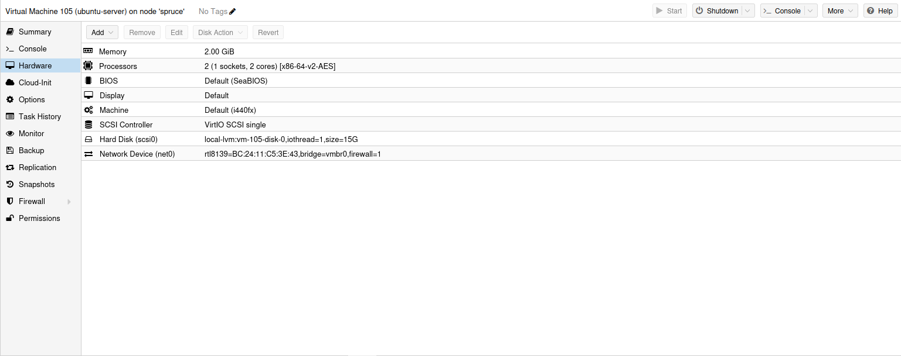
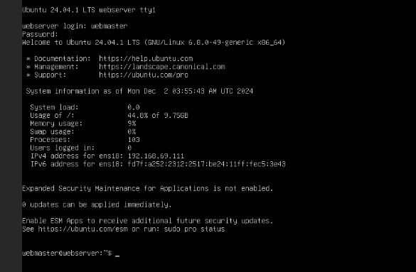
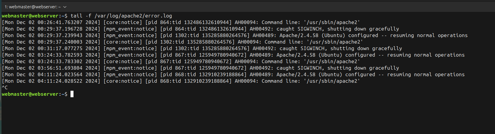

# Deliverable 2 Submission

## Server Specifications

## Ubuntu Login Screen

## Questions
3. **What is the IP address of your Ubuntu Server Virtual Machine?**
   `192.168.69.111`
4. **How do you enable the Ubuntu Firewall?**
   `sudo ufw enable/allow`
5. **How do you check if the Ubuntu Firewall is running?**
   `sudo ufw status`
6. **How do you disable the Ubuntu Firewall?**
   `sudo ufw disable`
7. **How do you add Apache to the Firewall?** 
   `sudo ufw allow 'Apache'`
8. **What is the command you used to install Apache?**
   `sudo apt install apache2 -y`
9.  **What is the command you use to check if Apache is running?**
    `systemctl status apache2 --no-pager`
10. **What is the command you use to stop Apache?**
    `sudo systemctl stop apache2`
11. **What is the command you use to restart Apache?**
    `sudo systemctl restart apache2`
12. **What is the command used to test Apache configuration?**
    `sudo apache2ctl configtest`
13. **What is the command used to check the installed version of Apache?**
    `apache2 -v`
14. **What are the most common commands to troubleshoot Apache errors? Provide a brief description of each command.**
    `sudo apache2ctl configtest`: This command checks the Apache configuration files for syntax errors. It's useful to run after making changes to the configuration to ensure there are no mistakes.

    `apache2ctl -t`: Similar to the configtest command, this tests the configuration files for any errors without starting or restarting the server.

    `systemctl status apache2`: This command shows the current status of the Apache service, including whether it is running, stopped, or encountered any issues.
15. **Which are Apache Log Files, and what are they used for? Provide examples and screenshots.**
    Apache logs are stored within `/var/log/apache2/error.log`. This log is used for monitoring and troubleshooting your apache web server. The purpose is to record specific information about the server's operations like requests,errors and etc.
    