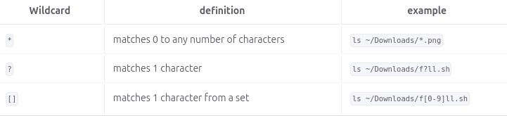

# Notes 6

## * Wildcard

* Matches 0 to any number of characters

### Examples:

* list all the files that end in .txt:
  * `ls *.txt`
* list all the files that end in .txt & .pdf:
  * `ls *.txt *.pdf`
* list all the files that have any letter before the string "file." and after as well:
  * `ls *file.*`

## ? Wildcard

* Matches precisely one character

### Examples:

* list all hidden files:
  * `ls .??*`
* list all hidden files in the current directory:
  * `ls ./.??*`
* list all the files that have a 3 letter file extension:
  * `ls *.???`

## [] Wildcard

* Matches a single character in a range

### Examples:

* To match all files that have a vowel after letter f:
  * `ls f[aeiou]*`
* To match all files whose name has at least one number:
  * `ls *[0-9]*`
* To match all the files whose name does not have a number in their file name:
  * `ls *[!0-9].*`

## Brace Expansion

* Not a wildcard but another feature of bash that allows you to generate arbitrary strings to use with commands.

### Examples:

* To create a whole directory structure in a single command:
  * `mkdir -p music/{jazz,rock}/{mp3files,videos,oggfiles}/new{1..3}`
* To create a N number of files use:
  * `touch website{1..5}.html`
* To remove multiple files in a single directory:
  * `rm -r {dir1,dir2,dir3,file.txt,file.py}`