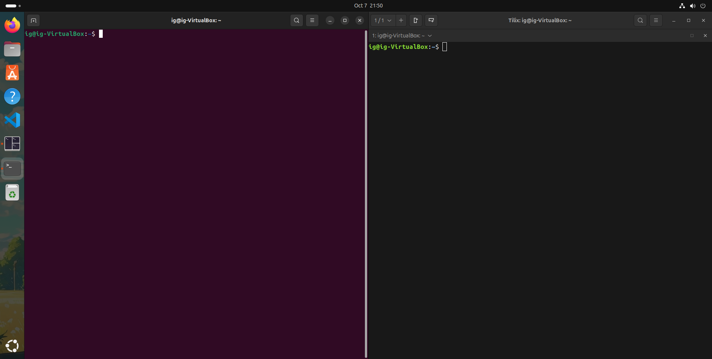
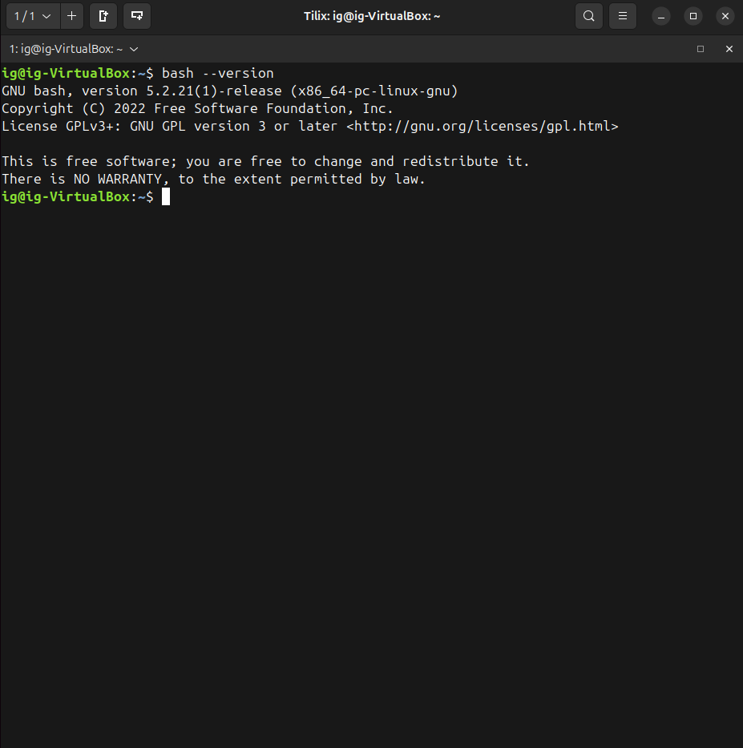
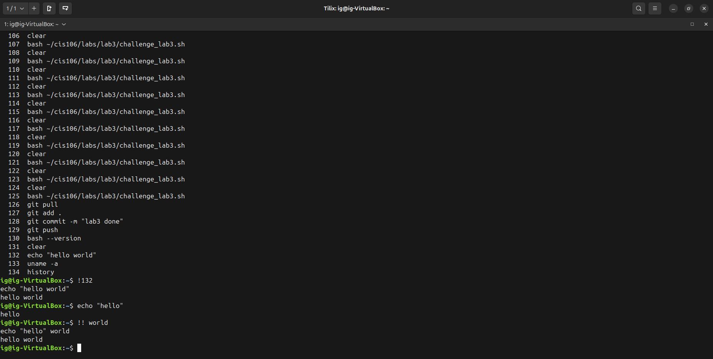
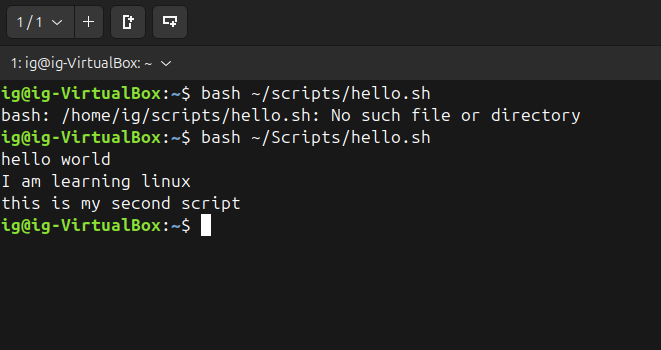
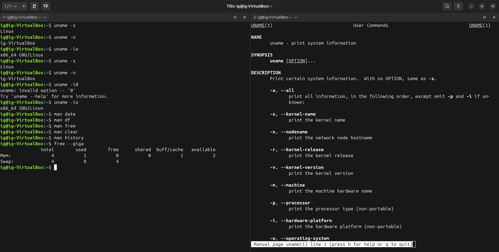
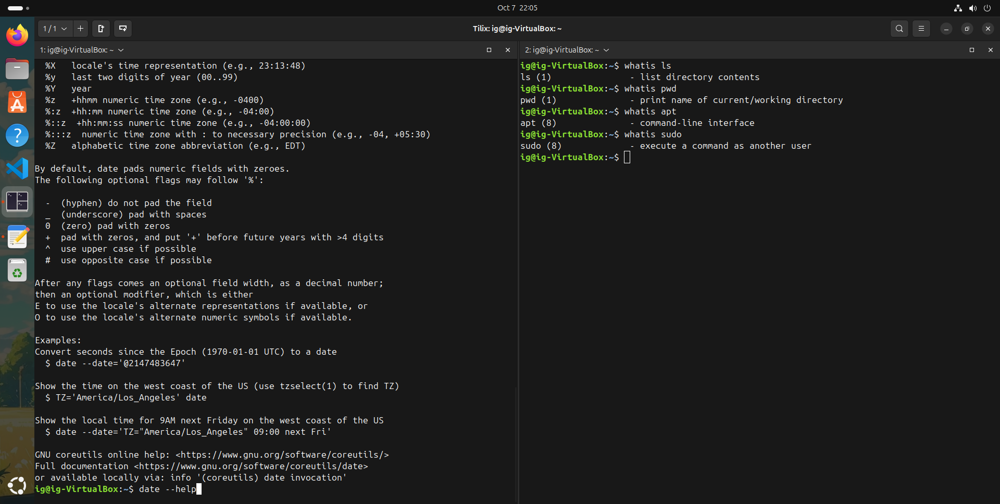
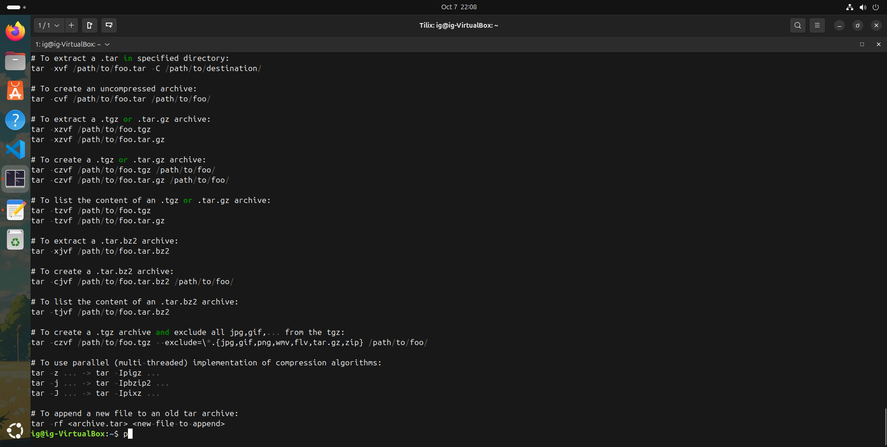
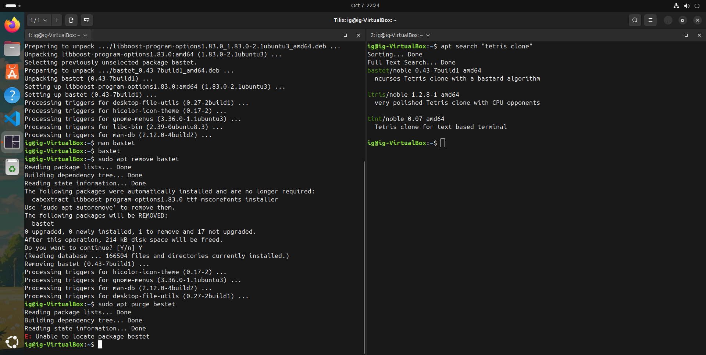
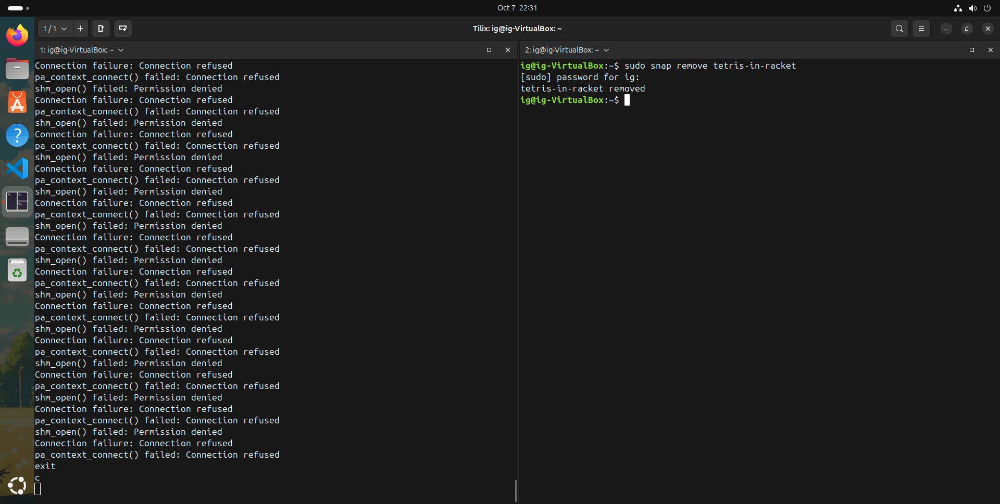

# Week Report 3
## Completed word for week 3
* [Lab3](https://github.com/IzaiahG823/cis106/blob/main/labs/lab3/lab3.md)
* [Notes3](https://github.com/IzaiahG823/cis106/blob/main/notes/notes3/notes3.md)
* [Managing software Cheat Sheet](../../cheatSheets/Managing%20Software%20Cheat%20Sheet.png)
* [What is a shell](https://docs.google.com/presentation/d/e/2PACX-1vSMW_nt1pQzuvuV3HlZ-3gw9ObsRqnTVSPRW34tPB-cJ_iUgwuVr1iKY8MdWxh4_ctfRq9PDpXPMdif/pub?start=false&amp;loop=false&amp;delayms=3000#slide=id.p)
* [Managing Software](https://rapurl.live/nft)

## Practice
### Practice 1

### Practice 2

### Practice 3

### Practice 4

### Practice 5

### Practice 6

### Practice 7

### Practice 1 - Managing Software

### Practice 3 - Managing Software

